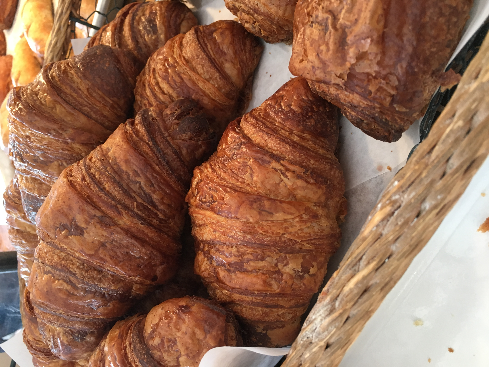
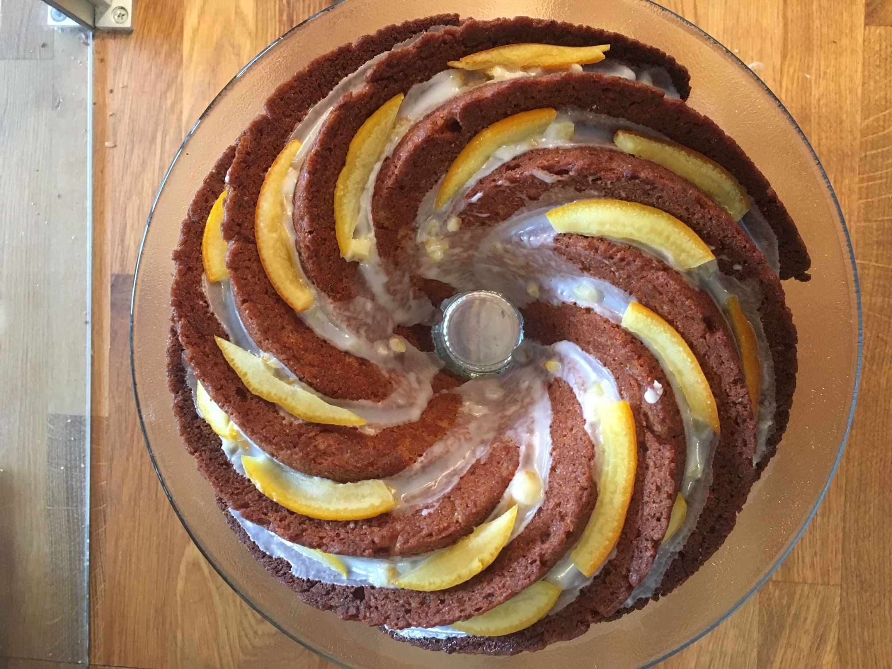
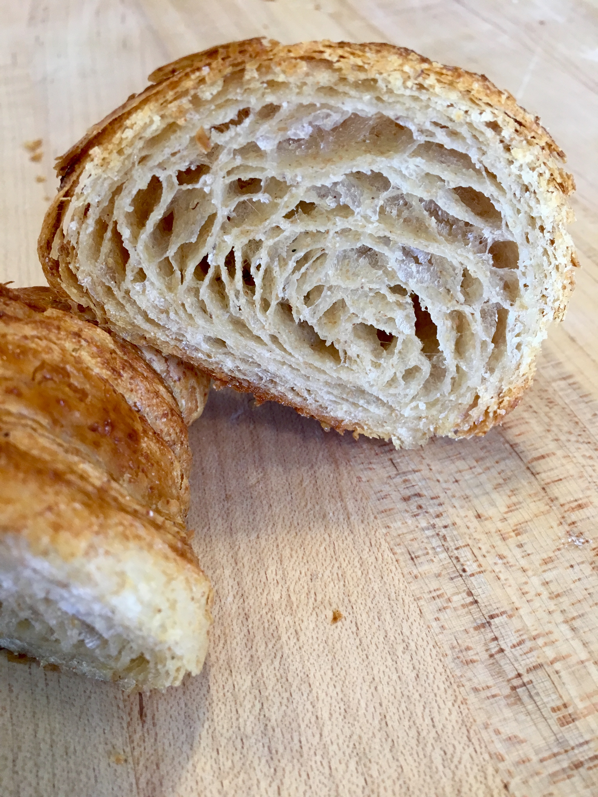
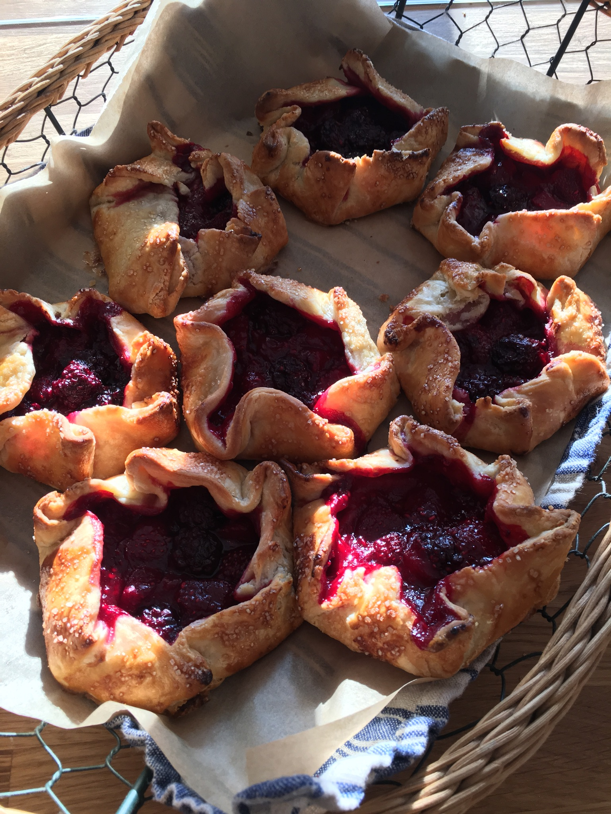
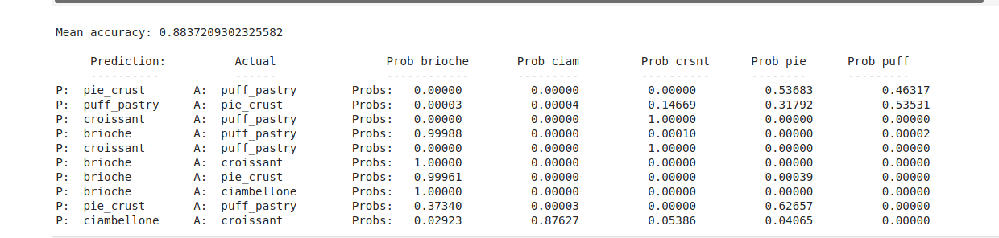
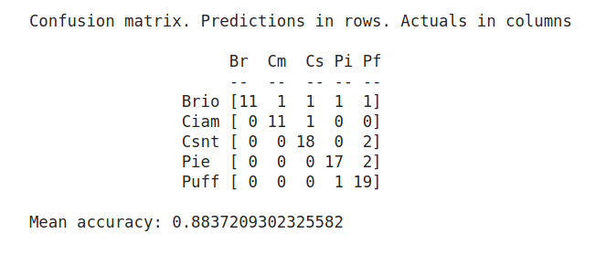

# bytes-into-baking
</img>

## Project Overview
- Food is one of the most common topics on the internet, with content being published on the web by big businesses such as *foodnetwork* and *allrecipes* to home chefs writing their own blogs. 
- Food is trendy--keeping on top of food trends could be valuable to people who work in the food or food publishing industries.
- The purpose of this project is to gather recipe data from a variety of different websites and then use supervised and unsupervised NLP models to discover useful information from the data

## Project Phases
- Create a utility web scraper to capture recipes from a variety of different websites
- Use ML to compare and contrast recipes

## Goals
- Generate a list of target websites for a particular recipe class by pulling urls from Google search
- Develop a utility scraper to identify recipes and then grab pertinent information about the recipe from the recipe section--starting with instructions
- Test the results of the scraper on a supervised model that classifies the vectorized recipes
- Explore the possibiliity of identifying different groupings within a specific recipe class

## Tools and techniques used in this project
- **Tools**
> - Python, Beautiful Soup, Pandas, Numpy, Gensim
- **Visualization**
> - Matplotlib, Plotly
- **Techniques**
> - Web-scraping, K Fold cross validation, Multinomial Naive Bayes Classification, Non-negative Matrix Factoring (NMF)

## Phase one of the project
- Web recipe scraper
- Uses Google search to gather target website urls
- Uses scraper.py to scrape the urls for recipes

### A focus on pastry recipes
- I chose to start with pastry recipes since I come with an indepth knowledge of this space. I've explored hundreds of pastry recipe websites over my career.
- I chose five categories of pastry and baked goods recipes that had what I considered to be important differences, yet enough similarity that they might confuse a model.
> - Brioche 
> - Ciambellone
> - Croissants
> - Pie crust
> - Puff pastry

  

    </img>
  

  

    </img>
  

  

    </img>
  

  

    </img>
  

 

### Numerous ways to format a recipe, but some intriguing similarities make a utility scraper possible
- My initial Google search website 'spider' yielded more than recipe websites--I needed a scraper that would limit the possibility of seeing a recipe when one wasn't there
- More than a third of recipes I encountered follow a schema format promoted by Yoast, a website schema publisher to aid in SEO optimization--useful tags and a json structure with standardized keys for things like recipe ingredients and instructions (Yeah!)
- Another 40-50% placed the body of their recipe in a script tag with one of several commonly used attributes. This wasn't as clean of an approach--I usually ended up with extra text--but I still was able to get some results
- The rest, well, some didn't want to be scraped, and some had unusual structures. I could spend a lot of time chasing the tail with limited utility.
- Results:

| Recipe | First pass links from Google search | Usable recipes obtained |  Yield |
| :---: | :---: |  :---: |  :---: |
| Brioche     | 112   |  55     | 49% |
| Ciambellone | 116   |  55     |  47% |
| Croissant   | 180   |  72     | 40% |
| Puff pastry | 200   |  86     | 43% |
| Pie crust   | 122   |  74     | 60% |

## Phase two of the project
- Corpus preprocessing and turning documents into vectors
- Using a supervised model (multinomial naive bayes) to predict recipe class (after target words like 'croissant' or 'puff pastry' have been removed from the feature set)
- Using unsupervised machine learning to look for similarities and differences between recipes of a certain class

### Corpus preprocessing
- Turned the recipe documents into vectors for a supervised machine learning classifier problem--can recipe instructions be used to predict recipe class?
- Text preprocessing pipeline included removing punctuation, tokenization, word lemmatization, removing stop words
- Additionally, removed target words (like croissant, puff pastry etc) that appear in the feature set to build a more robust model
- Converted documents into uni-gram count vectors

### Multinomial naive bayes text classifer
- Train test split initially
- K Fold cross validation to get a more accurate measure of accuracy

## Results
- Mean accuracy of about 90% for the train test split set
- Similar results from the K Fold cross validation approach

    </img>

 

    </img>

 
  
  

## Analysis
- Most of the errors occurred before the ML model step. In several cases, the recipe author misclassified their recipe. One common mistake is to classify a pie crust as a puff pastry--they are not the same. Google search also can have a relatively high rate of type 2 errors--false positives. Non-recipe websites were weeded out by the web scraper, but some non-target recipes made it through. For instance, a breakfast sausage croissant sandwich recipe made it through.
- The scraper grabbed insufficient data in one case.
- The model made bad predictions in two cases.

| Error type | Number | Percent (%) |
| :--- |  :---: | :---: |
| Recipe author miscategorization or inaccurate Google search data | 7 | 8% |
| Scraper error | 1 | 1% |
| Bad prediction by model | 2 | 2% |

# Future Directions
- Improve the web scraper to get a higher yield while maintaining its high accuracy
- Experiment with word2vec to see if features provide more intuition
- With a given class (such as croissants), perform latent topics analysis with Non-negative Matrix Factorization (NMF) to see if an unsupervised model can provide utility (Perhaps it can help to separate the great websites like Gourmetier from the rest)

## EDA from an early phase of the project
### Searching for croissant baking temperatures
- Searches for 'croissant bake temperature' or 'temperature cuisson croissant' were conducted on Google country-specific search sites for the US, UK, and France. The first 100 links were obtained for each country. These links were subsequently scraped to determine if they were a croissant baking recipe, and if so, for their initial baking temperature.
- Baking temperatures were found by looking for sentences that contained the words 'preheat', 'bake', or 'oven' followed by a 3 digit number followed by a temperature indicator. 
- Croissant baking often employs a two-stage approach with a high starting temp followed by a lower finishing temp. The script pulled the first temperature mention, so this is the starting temp.
- For the US graphic, websites were excluded if the first temperature mention was in celsius.
- For the UK and French graphics, websites were excluded if the first temperature mention was in fahrenheit.
### Results from the Preliminary EDA phase
- Of the 140 links obtained from the Google search by country, 50+ usable temperatures were obtained for the US distribution and for the French distribution.
- Only 12 usable temperatures were obtained for the UK distribution. This is likely due to many recipes of US origin appearing in the google.uk search and being filtered out due to our restriction that temps needed to be expressed primarily in celsius.
- Mean temperatures are higher in the US than in France or the UK. Means testing has not been performed yet.
- The distributions are slightly different for the countries with France having what appears to be a slightly right-skewed distribution compared to the US distribution.
</img>
<pre>

</pre>
</img>
<pre>

</pre>
</img>
<pre>

</pre>
## Web scraper design

### A focus on pastry recipes
- I chose to start with pastry recipes since I come with an indepth knowledge of this space. I've explored hundreds of pastry recipe websites over my career.
- I chose four categories of pastry and baked goods recipes that had what I considered to be important differences, yet enough similarity that they might confuse a model.

### Numerous ways to format a recipe, but some intriguing similarities make a utility scraper possible
- My initial Google search website 'spider' yielded more than recipe websites--I needed a scraper that would limit the possibility of seeing a recipe when one wasn't there
- More than a third of recipes I encountered follow a schema format promoted by Yoast, a website schema publisher to aid in SEO optimization--useful tags and a json structure with standardized keys for things like recipe ingredients and instructions (Yeah!)
- Another 40-50% placed the body of their recipe in a script tag with one of several commonly used attributes. This wasn't as clean of an approach--I usually ended up with extra text--but I still was able to get some results
- The rest, well, some didn't want to be scraped, and some had unusual structures. I could spend a lot of time chasing the tail with limited utility.

### Results

- First pass links from Google search | Usable recipes obtained |  Yield
- Brioche               | 112       | 55     | 49%
- Ciambellone           | 116       | 55     |  47%
- Croissant             | 180       | 72     | 40%
- Puff pastry           | 200       | 86     | 43%

## Future Directions
- Develop a spider to crawl targeted websites instead of relying on Google search
- Improve the search web-scraping function to obtain a better yield
- Replace search with an unsupervised NLP model
- Explore other parameters of croissant preparation and baking.
- Explore the comments for the various websites to determine if people in the respective countries interact differently with recipe authors.
- Once the tools are in good shape, use them to explore other food topics.
